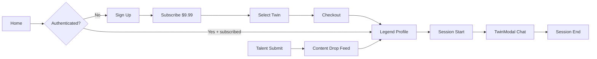

# RICON Storyline — Fan Experience Implementation Map

> Audit date: 2026-05-24 · POC investor/stakeholder demo  
> Scope: map existing structure vs. Fan Experience spec. **No functional changes in this document.**

---

## 1. Framework & Architecture

| Aspect | Current state |
|--------|---------------|
| **Bundler** | [Vite 5](vite.config.js) + `@vitejs/plugin-react` |
| **UI** | React 18 SPA (`main.jsx` → `ricon-storyline.jsx`) |
| **Routing** | **None** — screen state in root component (`screen: "home" \| "athlete"`) |
| **Styling** | Single CSS string in [`src/styles.js`](src/styles.js) — dark cinematic tokens (`--background`, `--primary`, `--premium`, etc.). **Not Tailwind.** |
| **Backend** | **None** — fully client-side |
| **AI / streaming** | **None** — Q&A uses local keyword matching + `setTimeout` delays |
| **Persistence** | **None** — messages reset on modal close / mode switch |
| **Auth / billing** | **None** |

**Stack note:** This is a Vite SPA, not Next.js App Router. Fan Experience features should extend this structure unless a deliberate migration is planned.

---

## 2. Project Structure (current)

```
RICON-Storyline/
├── index.html                 # Entry HTML, Figma capture script
├── main.jsx                   # ReactDOM.createRoot
├── ricon-storyline.jsx        # Root app shell + screen routing
├── vite.config.js
├── package.json
└── src/
    ├── styles.js              # Full design system (CSS variables + classes)
    ├── data/
    │   └── athletes.js        # Legends, filters, TYPE_CONFIG, buildSystemPrompt (unused)
    └── components/
        ├── HomeScreen.jsx     # Landing, category filters, legend grid
        ├── AthleteScreen.jsx  # Legend profile, timeline, twin CTAs
        ├── AthleteCard.jsx    # Browse card
        ├── TimelineMoment.jsx # Scroll-reveal timeline item + source row
        └── TwinModal.jsx      # Digital twin chat (Narrator + Q&A)
```

---

## 3. Existing “Routes” (virtual screens)

There is no URL router. Navigation is **in-memory screen state** in [`ricon-storyline.jsx`](ricon-storyline.jsx):

| Screen | Trigger | Component | Notes |
|--------|---------|-----------|-------|
| **Home** | Default | `HomeScreen` | Legend browse, category filters, featured picks |
| **Legend profile** | Select card | `AthleteScreen` | Timeline, stats, twin activation |
| **Twin modal** | `onTwin(mode)` | `TwinModal` | Overlay; modes: `narrator` \| `qa` |

**Query-param hooks (Figma / demo only):**

| Param | Effect |
|-------|--------|
| `?figmaTwin=narrator` | Opens Jordan athlete + twin modal, all narrator beats pre-loaded |
| `?figmaTwin=qaThread` | Opens Jordan + Q&A with canned thread |

---

## 4. Missing Routes / Screens (Fan Experience spec)

These do not exist today. Recommended **virtual screens** (extend `ricon-storyline.jsx`) or add **React Router** if shareable URLs are required.

| Screen | Purpose | Suggested path (if router added) |
|--------|---------|----------------------------------|
| **Sign up** | Email / account creation | `/signup` |
| **Subscribe** | $9.99/mo single-twin plan | `/subscribe` |
| **Twin selection (subscription)** | Pick one subscribed twin | `/subscribe/select` or `/twins` |
| **Checkout** | Stripe or simulated POC payment | `/checkout` |
| **Account / subscription status** | Manage plan, billing | `/account` |
| **Content drop feed** | Fan-facing new content | `/feed` or tab on home |
| **Talent submission** | Talent-side content form | `/talent/submit` (separate entry or role-gated) |
| **Session end** | Post-chat summary, re-subscribe CTA | Modal or `/session/end` |

**Gating:** Twin activation (`AthleteScreen` → `TwinModal`) should eventually require `authenticated + subscribed + twin matches subscription`.

---

## 5. Existing Data Sources

| Source | Location | Contents | Used by |
|--------|----------|----------|---------|
| **Legend catalog** | `src/data/athletes.js` | 22 legends (NBA, NFL, MLB, music); stats, moments, voice, tagline, headshots | Home, Athlete, Twin |
| **Featured / filters** | `athletes.js` exports | `FEATURED_HERO`, `FEATURED_PICKS`, `FILTERS`, `TYPE_CONFIG` | `HomeScreen` |
| **System prompt template** | `buildSystemPrompt(legend)` in `athletes.js` | Core-grounding rules + verified moments | **Exported but unused** |
| **External images** | CDN / Wikimedia URLs in legend objects | Headshots, hero images | Cards, hero, twin avatar |
| **Twin Q&A logic** | Inline in `TwinModal.jsx` | `answerQuestion`, `pickMoment`, `narratorBeats` | Twin Q&A + Narrator |

**Not present:** user accounts, subscriptions, conversations DB, content drops, source-attribution logs, Stripe, Core API.

---

## 6. Existing Chat / Twin Components

| Component | Role | Extend vs. replace |
|-----------|------|-------------------|
| **`TwinModal.jsx`** | Full-screen twin UI: header, mode toggle, avatar rail, message list, composer, voice (Web Speech API) | **Extend** — primary surface for streaming, persistence, session states |
| **`AthleteScreen.jsx`** | Pre-chat marketing + timeline; twin entry points | **Extend** — add subscription gate, content drop preview |
| **`TimelineMoment.jsx`** | Verified moment + `source-row` (`moment.src`) | **Extend** — pattern for source attribution in chat |
| **`answerQuestion()`** (TwinModal) | Client-side refusal + moment matching | **Replace logic, keep UI** — wire to Core API / streaming |
| **`buildSystemPrompt()`** (athletes.js) | Intended LLM system prompt | **Wire up** — server-side or API route |

### TwinModal behavior today

- **Narrator mode:** 3 scripted beats, chapter markers, placeholder video cards, no persistence
- **Q&A mode:** Keyword router over `athlete.moments`; 700ms fake delay; typing dots; no token streaming
- **Refusal:** Generic line when query doesn’t match heuristics (partial Core-grounding)
- **Source attribution:** UI shows “Verified twin response” only — **no per-reply source IDs or logging**
- **Session:** No explicit start/end; closing modal clears state

---

## 7. Reusable UI to Extend (do not replace design system)

Preserve [`src/styles.js`](src/styles.js) tokens and class names. Reuse these patterns:

| Pattern | Classes / components | Fan Experience use |
|---------|---------------------|-------------------|
| **Nav shell** | `.app-nav`, `.brand-mark`, `.status-pill` | Auth-aware header, subscription badge |
| **CTAs** | `.primary-button`, `.premium-button`, `.cta-glow` | Subscribe, checkout confirm |
| **Cards** | `.featured-card`, `.card-root`, `.stat-card` | Plan card, content drop cards |
| **Modal shell** | `.modal-root`, `.modal-header`, `.modal-layout` | Twin chat, checkout, session end |
| **Messages** | `.messages`, `.user-bubble`, `.assistant-message`, `.typing` | Streaming tokens, message status |
| **Composer** | `.modal-composer`, `.voice-dock`, `.twin-input` | Chat input (already sticky) |
| **Source row** | `.source-row`, `.verified-meta` | Per-message attribution |
| **Empty states** | `.empty-state`, `.qa-empty-state` | Pre-session, no drops |
| **Pills / filters** | `.filter-tab`, `.eyebrow-pill`, `.type-pill` | Feed filters, drop types |
| **Forms** | Extend `.twin-input` + button variants | Signup, talent submit |

**Do not introduce Tailwind or a new component library** unless the team explicitly migrates — match existing CSS-in-JS string approach or extract small shared JSX wrappers that use existing classes.

---

## 8. Proposed New Files (incremental)

```
src/
├── context/
│   ├── AuthContext.jsx           # user session (POC: localStorage mock)
│   └── SubscriptionContext.jsx   # active twin id, plan status, expiry
├── hooks/
│   ├── useChatSession.js         # session start/end, message lifecycle
│   ├── useChatPersistence.js     # localStorage → later API
│   └── useContentDrops.js        # feed + twin-available drops
├── lib/
│   ├── stripe.js                 # Stripe.js or POC checkout simulator
│   ├── chatClient.js             # streaming fetch / SSE to Core backend
│   └── attributionLog.js         # source refs per assistant message
├── data/
│   ├── subscriptionPlans.js      # $9.99 single-twin plan definition
│   └── contentDrops.js           # POC seed drops (until CMS)
├── services/
│   └── coreTwin.js               # buildSystemPrompt + Core API adapter
└── components/
    ├── auth/
    │   ├── SignUpScreen.jsx
    │   └── SignUpForm.jsx
    ├── subscription/
    │   ├── SubscribeScreen.jsx
    │   ├── TwinSelectScreen.jsx
    │   ├── CheckoutScreen.jsx      # Stripe or simulated
    │   └── SubscriptionGate.jsx    # wraps twin CTAs
    ├── chat/
    │   ├── MessageList.jsx         # extract from TwinModal
    │   ├── MessageBubble.jsx
    │   ├── StreamingIndicator.jsx
    │   ├── SessionStart.jsx
    │   ├── SessionEnd.jsx
    │   └── SourceAttribution.jsx   # extends .source-row pattern
    ├── feed/
    │   ├── ContentDropFeed.jsx
    │   └── ContentDropCard.jsx
    └── talent/
        └── ContentSubmitForm.jsx
```

**Root app changes (minimal):**

- [`ricon-storyline.jsx`](ricon-storyline.jsx) — add screen enum values + providers; optional React Router
- [`TwinModal.jsx`](src/components/TwinModal.jsx) — delegate send/stream/persist to hooks; keep layout/CSS

---

## 9. Feature → Implementation Location

| Fan Experience requirement | Where to implement | Starting point |
|---------------------------|-------------------|----------------|
| **Sign up** | `SignUpScreen` + `AuthContext` | New screen before home or gated twin |
| **$9.99/mo single-twin subscription** | `subscriptionPlans.js` + `SubscribeScreen` | Plan constants; one `twinId` on subscription |
| **Twin selection** | `TwinSelectScreen` | Reuse `AthleteCard` / legend list; enforce single selection |
| **Stripe / simulated checkout** | `CheckoutScreen` + `lib/stripe.js` | POC: mock success → `SubscriptionContext` |
| **Core twin chat UI** | **`TwinModal`** (existing) | Keep modal shell; extract message list |
| **Streaming responses** | `lib/chatClient.js` + `TwinModal` / `MessageBubble` | Replace `wait(700)` + full reply with SSE/chunk append |
| **Conversation persistence** | `useChatPersistence.js` | Key: `userId + twinId + sessionId` in localStorage → API |
| **Session start / end** | `SessionStart.jsx`, `SessionEnd.jsx` | Hook into twin open/close; end summary + attribution rollup |
| **Core-grounded replies + refusal** | `services/coreTwin.js` + wire `buildSystemPrompt` | Backend calls Core; client shows refusal copy from API |
| **Source attribution logging** | `SourceAttribution.jsx` + `attributionLog.js` | Mirror `TimelineMoment` `.source-row`; log `{ messageId, sources[] }` |
| **Content drop feed** | `ContentDropFeed` on home or `/feed` | New section using `.featured-grid` / card patterns |
| **Talent content submission** | `ContentSubmitForm` | Separate screen; POST to mock API / Sanity later |
| **New drops → twin chat** | `useContentDrops` injected into `buildSystemPrompt` / Core context | On drop publish, refresh twin knowledge + feed badge |

---

## 10. Suggested User Flow (POC)



---

## 11. Risks & Assumptions

### Risks

1. **No router** — deep links, back button, and shareable checkout URLs don’t work until React Router (or similar) is added.
2. **No backend** — auth, Stripe webhooks, Core API, and real persistence cannot ship securely from the browser alone; a thin API layer (Vite proxy + serverless, or separate BFF) will be required for production.
3. **`buildSystemPrompt` unused** — Core-grounding rules exist in data but Q&A bypasses them via `answerQuestion()` heuristics; wiring must replace, not duplicate, refusal logic.
4. **TwinModal monolith** — ~560 lines mixing UI, voice, narrator, and Q&A logic; extract hooks/components early to add streaming without regressions.
5. **Message keys use array index** — should move to stable IDs before persistence/sync.
6. **External image URLs** — CDN/Wikimedia dependencies may break or slow load; not blocking POC.
7. **Design system is one file** — large `styles.js`; new screens should reuse classes to avoid CSS drift.

### Assumptions

1. **POC checkout** can simulate Stripe success client-side; real Stripe Checkout is a swap in `lib/stripe.js` + webhook handler later.
2. **Single-twin subscription** means one active `twinId` per user at a time; switching twin requires plan change or upsell (out of scope unless specified).
3. **“Core”** is an external grounded-knowledge service; this repo consumes it via API — `buildSystemPrompt` + moment `src` fields are the local stand-in corpus until Core is connected.
4. **Content drops** can start as static seed data (`contentDrops.js`) with talent form appending to the same store (localStorage) for demo.
5. **Visual language stays** — dark cinematic RICON tokens in `styles.js` remain the source of truth; no redesign.
6. **Narrator mode** may remain scripted for POC while Q&A gets real streaming first (confirm with product).

---

## 12. Recommended Implementation Order

1. **Router + screen enum** — signup, subscribe, select, checkout (simulated), account stub  
2. **SubscriptionContext + gate** on `AthleteScreen` twin buttons  
3. **Extract chat hooks** from `TwinModal`; add session start/end UI  
4. **Streaming + Core adapter** (replace `answerQuestion` for Q&A)  
5. **Persistence + attribution logging**  
6. **Content drop feed + talent form + twin context refresh  

---

## 13. Acceptance Checklist (this audit)

- [x] Full project structure inspected  
- [x] Framework identified (Vite + React SPA)  
- [x] Routes, layouts, data, state, and components located  
- [x] Design system preserved (documented, not modified)  
- [x] Implementation map created  
- [x] Signup, subscription, chat persistence, Core-grounding, and content drops mapped to files  

**No major functional changes were made in this pass.**
